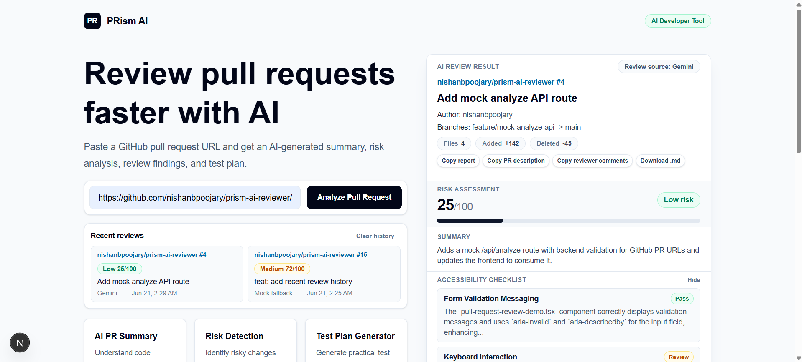
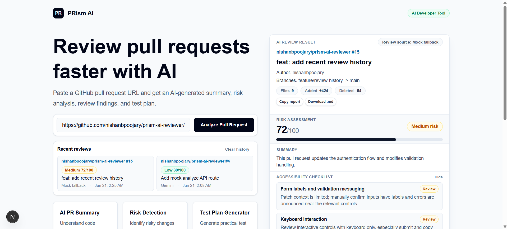
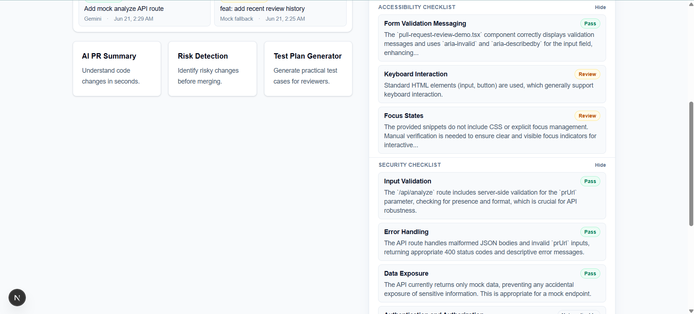
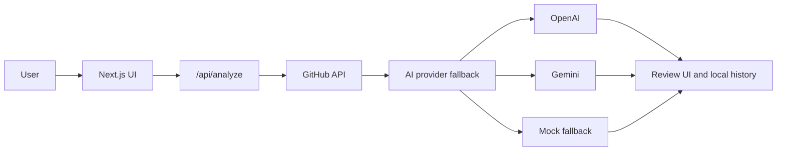

# PRism AI

PRism AI is an AI-powered pull request review assistant for developers. Paste a public GitHub pull request URL, and the app fetches PR metadata plus changed-file context, then generates a practical review with risk assessment, findings, test ideas, suggested PR copy, reviewer comments, and accessibility/security checklists.

The project is built as a focused Next.js application that keeps API keys server-side, uses AI provider fallback gracefully, and stores recent review history locally in the browser.

## Screenshots

### AI review overview — Gemini provider



PRism AI analyzes a public GitHub pull request, displays repository metadata, risk assessment, findings, test cases, suggested PR description, reviewer comments, and recent review history.

### AI review overview — mock fallback



The app remains usable even when no AI provider is available. It safely falls back to a structured mock review so the complete experience can still be demonstrated.

### Accessibility and security checklists



Each review includes dedicated accessibility and security checklist sections with clear **Pass**, **Review**, and **Not applicable** statuses.

## Features

- GitHub pull request URL validation and metadata fetching
- Changed-file context for review generation
- AI-generated risk assessment with score and risk level
- Review findings, suggested test cases, suggested PR description, and reviewer-friendly comments
- Dedicated accessibility and security checklists
- Recent review history stored in browser `localStorage`
- Copy actions for the full report, PR description, and reviewer comments
- Markdown report download
- Provider fallback from OpenAI to Gemini to mock data

## AI Provider Fallback

PRism AI uses a simple provider fallback flow:

1. OpenAI, when `OPENAI_API_KEY` is configured and available
2. Gemini, when `GEMINI_API_KEY` is configured and available
3. Mock fallback, so the app still works without AI keys

OpenAI is optional and requires a billed API account. Gemini is currently the active free provider when configured. The mock fallback keeps the demo usable when no AI provider is available.

## Architecture



## Tech Stack

- Next.js App Router
- TypeScript
- Tailwind CSS
- GitHub REST API
- OpenAI API
- Gemini API
- Browser `localStorage` for recent review history

## Local Setup

1. Install dependencies:

```bash
npm install
```

2. Copy the example environment file:

```bash
cp .env.example .env.local
```

On Windows PowerShell:

```powershell
Copy-Item .env.example .env.local
```

3. Add local environment values in `.env.local`:

```bash
GITHUB_TOKEN=
GEMINI_API_KEY=
OPENAI_API_KEY=
```

4. Start the development server:

```bash
npm run dev
```

5. Open the app:

```txt
http://localhost:3000
```

Do not commit `.env.local`. It is for local secrets only.

## Environment Variables

| Key | Required | Purpose |
| --- | --- | --- |
| `GITHUB_TOKEN` | Recommended | Used server-side to fetch GitHub pull request metadata and changed files with better rate limits. Public PRs may work without it, but a token is recommended. |
| `GEMINI_API_KEY` | Optional | Enables Gemini review generation. This is the active free AI provider when configured and OpenAI is unavailable. |
| `OPENAI_API_KEY` | Optional | Enables OpenAI review generation. OpenAI is tried first when configured, but requires a billed API account. |

## Commands

Run linting:

```bash
npm run lint
```

Create a production build:

```bash
npm run build
```

Start a production build locally:

```bash
npm run start
```

## Current Limitations

- Only public GitHub pull requests are supported.
- Review quality depends on the available PR metadata and changed-file summaries; full patch-level reasoning is a future improvement.
- OpenAI requires a billed API account; Gemini and mock fallback remain available.

## Future Improvements

- Deploy the application to a hosted environment.
- Add authentication for saved user workspaces.
- Move recent review history from browser storage to a database-backed history.
- Expand patch-level analysis with richer file-aware review reasoning.
